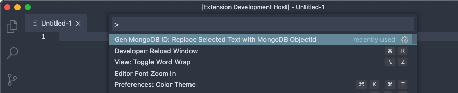
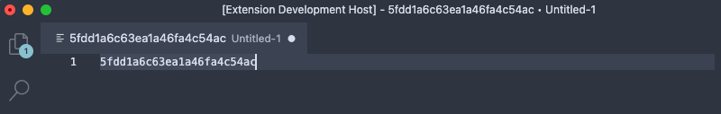
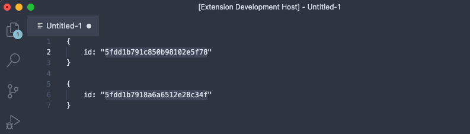

# README

VS Code extension for generating MongoDB IDs.

If you've ever found yourself searching google for a MongoDB ID generator, this is for you.

## Features

Simply type the command:

<!--  -->

which will place an ID at your cursor(s)

<!-- 

 -->

## Release Notes

### 1.0.0

Initial release

Supports replacing selection with a MongoID.

Supports multiple cursors.